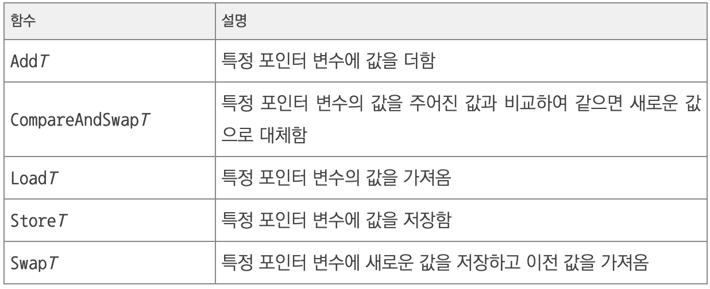

# **원자성을 보장하는 연산**
## **원자성을 보장하는 연산이란?**
- **원자성을 보장하는 연산**(atomic operation)이랑 **더 이상 쪼갤 수 없는 연산**을 말한다.

- **i += 1** 같은 **단순한 연산**이라 해도 최소 **세 단계**를 거친다.
    1. **메모리에서 값을 읽는다.**
    2. **값을 1 증가시킨다.**
    3. **새로운 값을 메모리에 다시 쓴다.**

 

---
## **연산이 원자성을 보장 받지 못한다면?**
- **고루틴 여러 개**를 동시에 실행하면 **CPU**는 각 고루틴을 **시분할**하여 **번갈아** 실행하는 **병행 처리**를 한다.
- 따라서, 이 단순한 계산에서도 **해당 연산**을 잠시 **중단** 후 **다른 고루틴**을 **수행**하게 되어 **동기화**에 문제가 발생한다.

 

---
## **sync/atomic**
- 앞서 말한 문제점 때문에 **Go**는 **sync/atomic** 이라는 **패키지**를 제공해준다.
- 이 패키지의 함수를 이용하면 **CPU**에서 **시분할** 하지 않고 **한 번에 처리**하도록 제어할 수 있다.

 

**sync/atomic 패키지가 제공하는 함수**

 

---
## **sync/atomic 사용 예시 코드**
~~~go
package main

import (
	"fmt"
	"runtime"
	"sync"
	"sync/atomic"
)

type counter struct {
	i int64
	mu sync.Mutex
	once sync.Once
}

const initialValue = -500

func (c *counter) increment() {
	c.once.Do(func() {
		c.i = initialValue
	})

    // 원자성을 보장하는 sync/atomic의 더하기 연산
	atomic.AddInt64(&c.i, 1)
}

func (c *counter) display() {
	fmt.Println(c.i)
}

func main() {
	// 모든 CPU를 사용하게 함
	runtime.GOMAXPROCS(runtime.NumCPU())

	c := counter{i:0} // 키운터 생성
	wg := sync.WaitGroup{} // WaitGroup 생

	// c.increment()를 실행하는 고루틴 1000개 실행
	for i:=0; i<1000; i++ {
		wg.Add(1) // WaitGroup 고루틴 갯수 1 증가
		go func() {
			defer wg.Done() // 고루틴 종료 시 Done() 처리
			c.increment() // 카운터 값을 1 증가 시
		}()
	}

	wg.Wait() // 모든 고루틴이 완료될 때까지 대기

	c.display()
}
~~~
~~~
실행 결과

500
~~~

 

- **여러 고루틴**에서 **공용 메모리**에 접근하고 있지만, **경쟁 상태**가 발생하지 않고 **정상적으로 동작**하는 걸 볼 수 있다.