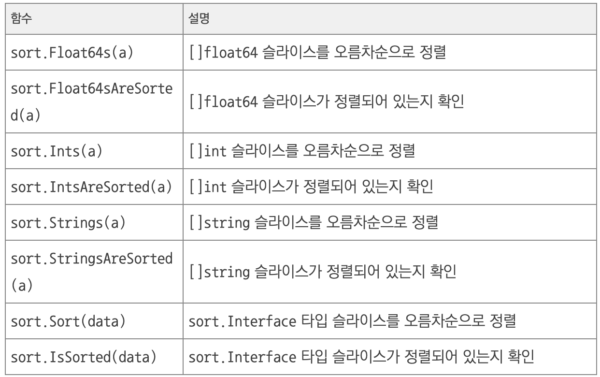

# **배열과 슬라이스의 추가적인 기능**

## **내부 요소에 순차적으로 접근**
- 배열/슬라이스에 **for...range 루프**를 사용하면 **각 요소의 인덱스와 값**을 얻어올 수 있다.
    ~~~go
    for index, value := range{}
    ~~~
- 다음 **예제 코드**를 보면 확실히 이해가 될 것이다.
    ~~~go
    numbers := []int{3, 4, 5, 7, 8, 4, 6, 8, 32, 4}
    for index, value := range numbers {
        fmt.Println(index, value)
    }
    ~~~
    ~~~
    실행 결과

    0 3
    1 4
    2 5
    3 7
    4 8
    5 4
    6 6
    7 8
    8 32
    9 4
    ~~~

- 인덱스를 사용하지 않고 요소의 값만 사용할 때는 인덱스 값을 **빈 식별자**(_)로 받으면 된다.
    ~~~go
    numbers := []int{3, 4, 5, 7, 8, 4, 6, 8, 32, 4}
    var sum int = 0
    for _, value := range numbers {
        sum += value
    }
    fmt.Println("sum: ", sum)
    ~~~
    ~~~
    실행 결과

    sum: 81
    ~~~

- 또한 **두 번째로 반환**되는 값은 **각 요소의 사본**이므로 **내부 요소의 값**을 변경하려면 **인덱스**로 접근해야 한다.
    ~~~go
    numbers := []int{3, 4, 5, 7, 8, 4, 6, 8, 32, 4}
	sum := 0
	for i := range numbers {
		numbers[i] *= 2
		sum += numbers[i]
	}
	fmt.Println("numbers:", numbers)
	fmt.Println("sum:", sum)
    ~~~
    ~~~
    실행 결과

    numbers: [6 8 10 14 16 8 12 16 64 8]
    sum: 162
    ~~~

 

## **부분 슬라이스 추출**
- **[] 연산자**로 **배열**이나 **슬라이스**의 일부를 **추출**할 수 있다.

- **[]연산자**로 부분 슬라이스 추출

 

~~~go
// [] 연산자 사용 예시 코드

s := []int{1, 2, 3, 4, 5, 6, 7}
fmt.Println(s, "=", s[:3], s[3:5], s[5:])
~~~
~~~
실행 결과

[1 2 3 4 5 6 7] = [1 2 3] [4 5] [6 7]
~~~

 

## **슬라이스 변경**

### **1. 슬라이스 추가**
- 슬라이스에 새로운 요소나 다른 슬라이스를 추가할 때는 **append()함수**를 사용한다.

- **append() 함수의 매개변수**
    - 첫 번째 매개변수 -> **원본 슬라이스** 전달
    - 이어서 원본 슬라이스에 **추가할 요소** 전달

- 또한 슬라이스의 **각 요소**를 **개별로 추가**할 때는 **... 연산자**를 사용한다.

    ~~~go
    ns1 := []int{1, 2, 3}
	ns2 := []int{6, 7, 8}
	ns3 := []int{8, 9, 10, 11}

	ns1 = append(ns1, 4, 5)	// ns1: [1, 2, 3, 4, 5]
	ns1 = append(ns1, ns2...)		// ns1: [1, 2, 3, 4, 5, 6, 7, 8]
	ns1 = append(ns1, ns3[1:3]...)	// ns1: [1, 2, 3, 4, 5, 6, 7, 8, 9, 10]

	fmt.Println(ns1)
    ~~~
    ~~~
    실행 결과

    [1, 2, 3, 4, 5, 6, 7, 8, 9 ,10]
    ~~~

- 만약 슬라이스의 **용량이 충분하지 않다면** 용량이 늘어난 **새 슬라이스**를 내부에 **만들어 반환**한다.
    ~~~go
    func main() {
        s := make([]int, 0, 3)
        for i := 0; i < 9; i++ {
            s = append(s, i)
            fmt.Printf("len: %d, cap: %d, %v\n", len(s), cap(s), s)
        }
    }
    ~~~
    ~~~
    실행 결과

    len: 1, cap: 3, [0]
    len: 2, cap: 3, [0 1]
    len: 3, cap: 3, [0 1 2]
    len: 4, cap: 6, [0 1 2 3]
    len: 5, cap: 6, [0 1 2 3 4]
    len: 6, cap: 6, [0 1 2 3 4 5]
    len: 7, cap: 12, [0 1 2 3 4 5 6]
    len: 8, cap: 12, [0 1 2 3 4 5 6 7]
    len: 9, cap: 12, [0 1 2 3 4 5 6 7 8]
    ~~~
 

### **2. 슬라이스 삽입**
- 슬라이스의 마지막이 아니라 **첫 번째나 중간에 요소를 삽입**해야 할 때가 있다.

- 그 기능을 하는 **함수를 제공하지 않으므로** 아래 코드와 같이 **직접 구현**해야 한다.
    ~~~go
    // 원본 슬라이스(s)의 측정 위치(index)에 새로운 슬라이스(new)를 삽입한다.

    func insert(s, new[] int, index int) []int {
	    return append(s[:index+1], append(new, s[index:]...)...)
    }
    ~~~

- **insert() 함수**를 이용한 예제 코드
    ~~~go
    s := []int{1, 2, 3, 4, 5}

	s = insert(s, []int{-3, -2}, 0)
	fmt.Println(s)			// s: [-3, -2, 1, 2, 3, 4, 5]

	s = insert(s, []int{0}, 2)
	fmt.Println(s)			// s: [-3, -2, 0, 1, 2, 3, 4, 5]

	s = insert(s, []int{6, 7}, len(s))
	fmt.Println(s)			// s: [-3, -2, 0, 1, 2, 3, 4, 5, 6, 7]
    ~~~

- 또한, 다음 **insert2()함수**는 insert()함수와 같은 기능을 **append()함수**를 **사용하지 않고 구현**한다.

    ~~~go
    // make()함수와 copy()함수를 이용하여 구현
    func insert2(s, new []int, index int) []int {
        result := make([]int, len(s)+len(new))
        position := copy(result, s[:index])
        position += copy(result[position:], new)
        copy(result[position:], s[index:])
        return result
    }
    ~~~

 

### **3. 정렬**
- Go의 기본 라이브러리인 **sort 패키지**에는 **슬라이스 정렬**과 관련된 다양한 **함수**가 있다.

 

**sort 패키지의 함수**

 

~~~go
s := []int{5, 2, 6, 3, 1, 4}
sort.Ints(s)
fmt.Println(s)
~~~
~~~
살행 결과

[1 2 3 4 5 6]
~~~