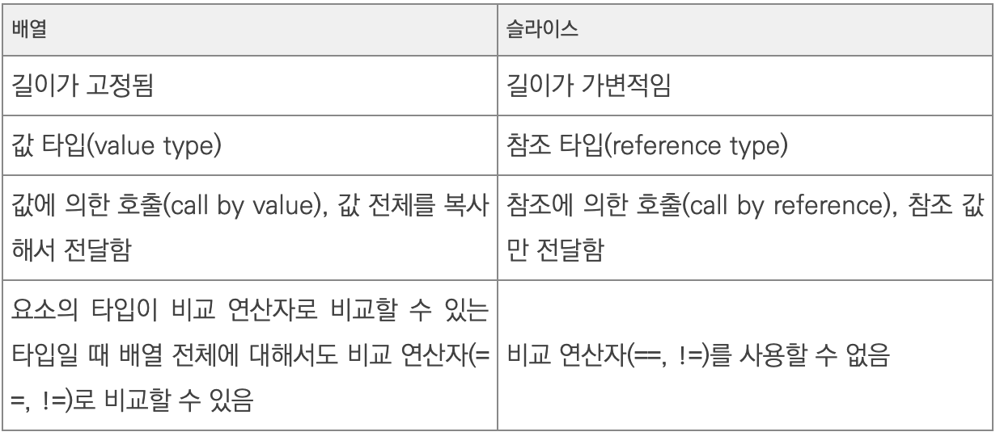
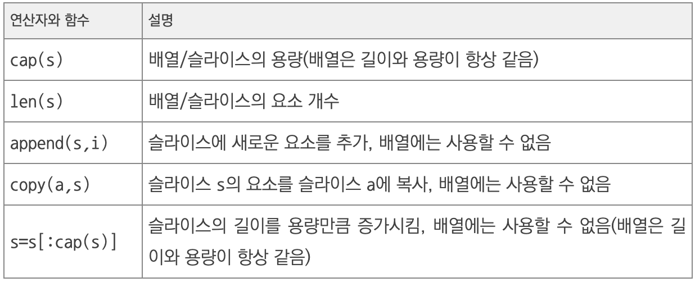

# **배열과 슬라이스**
- Go는 **순차 데이터의 시퀀스**를 다루기 위해 **배열**(Array)과 **슬라이스**(slice) 타입을 제공한다.
- **배열**은 길이가 **고정된 시퀀스**고, **슬라이스**는 길이가 **가변적인 시퀀스**다.

 

**배열과 슬라이스 비교**

 

- 배열보다 **슬라이스**가 더 **유연**하 고 **기능이 풍부**하며 사용하기도 쉽다.
- Go의 **기본 라이브러리**에도 배열보다 **슬라이스**를 사용한 코드가 **더 많다.**

 

**배열/슬라이스 연산자와 내장 함수**

 

---
## **생성과 초기화**

### 1. **배열**
- **배열**은 **다음과 같은 방식**으로 생성한다.
    - **[길이]타입**
    - **[길이]타입{초깃값}**
    - **[...]타입{초깃값}**

- **초깃값**을 **지정하지 않으면** 각 요소를 **제로값으로 초기화**한다.
- **배열의 길**이를 지정하지 않고 **...을 사용**하면 초깃값으로 지정된 **요소의 갯수**로 **배열의 길이**를 할당한다.

~~~go
// 배열을 생성하는 예제 코드

var a [5]int                    // 길이가 5인 int형 배열
b := [3]int{1, 2, 3}            // 배열 선언과 동시에 값을 초기화
c := [3]int{1, 2}               // 초깃값을 지정하지 않으면 0으로 초기화됨
d := [...]int{4, 5, 6, 7, 8}    // ...를 사용하여 배열의 길이를 지정
e := [3][3]int{ // 다차원 배열
    {1, 2, 3},
    {4, 5, 6},  // 요소를 여러 줄로 표기할 때, 요소의 마지막에 콤마를 붙여야 함
}

fmt.Printf("%-10T %d %v\n", a, len(a), a)
fmt.Printf("%-10T %d %v\n", b, len(b), b)
fmt.Printf("%-10T %d %v\n", c, len(c), c)
fmt.Printf("%-10T %d %v\n", d, len(d), d)
fmt.Printf("%-10T %d %v\n", e, len(e), e)
~~~
~~~
실행 결과

[5]int     5 [0 0 0 0 0]
[3]int     3 [1 2 3]
[3]int     3 [1 2 0]
[5]int     5 [4 5 6 7 8]
[3][3]int  3 [[1 2 3] [4 5 6] [0 0 0]]
~~~

 

### 2. **슬라이스**
- **슬라이스**는 **다음과 같은 방식**으로 생성한다.
    - **[]타입**
    - **[]타입{초깃값}**
    - **make([]타입, 길이, capacity)**
    - **make([]타입, 길이)**

- **make() 함수**로 슬라이스를 생성하면 **주어진 길이**만큼 제로값으로 **초기화된 배열**을 **내부 메모리 공간**에 **생성**하고 그것의 **참조를 반환**한다.
- **append() 함수**로 슬라이스의 **확장할 수 있는 최대 길이**가 **용량**(capacity) 이다.
- 슬라이스 길이가 **용량을 넘어서면** 내부 용량이 증가된 **새로운 배열을 생성**한다.
~~~go
// 슬라이스를 생성하는 예제 코드

var a []int		// int 형 슬라이스 선언, 길이와 용량은 0으로 지정됨
	b := []int{}	// int 형 슬라시스 선언, 길이와 용량은	0으로 지정됨
	c := []int{1, 2, 3}	// 슬라이스 선언과 동시에 값을 초기화
					// 길이와 용량은 요소의 개수로 지정됨
	d := [][]int{	// 다차원 슬라이스 선언
		{1, 2},
		{3, 4, 5},
	}

	e := make([]int, 0)	// make 함수로 길이와 용량이 0인 슬라이스 생성
	f := make([]int, 3, 5)	// make 함수로 길이가 3이고 용량이 5인 슬라이스 생성

	fmt.Printf("%-10T %d %d %v\n", a, len(a), cap(a), a)
	fmt.Printf("%-10T %d %d %v\n", b, len(b), cap(b), b)
	fmt.Printf("%-10T %d %d %v\n", c, len(c), cap(c), c)
	fmt.Printf("%-10T %d %d %v\n", d, len(d), cap(d), d)
	fmt.Printf("%-10T %d %d %v\n", e, len(e), cap(e), e)
	fmt.Printf("%-10T %d %d %v\n", f, len(f), cap(f), f)
~~~
~~~
실행 결과

[]int      0 0 []
[]int      0 0 []
[]int      3 3 [1 2 3]
[][]int    2 2 [[1 2] [3 4 5]]
[]int      0 0 []
[]int      3 5 [0 0 0]
~~~