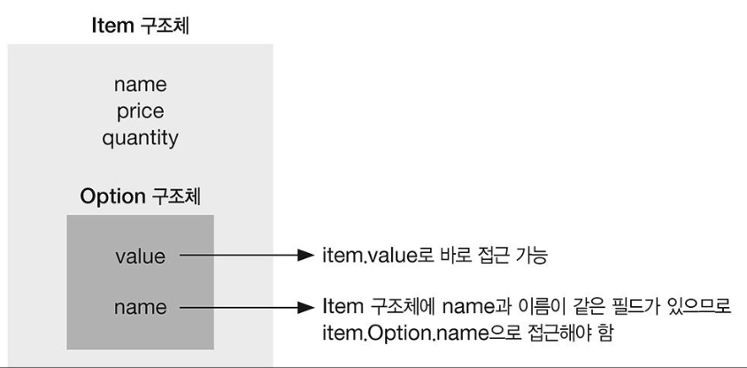

# **변수 이름**

- 변수 이름에는 공백을 포함하지 않은 **문자, 숫자, 밑줄**을 이용할 수 있다.
- 숫자는 첫 글자에 사용할 수 없다.
- 변수 이름에는 알파벳 뿐만 아니라 **유니코드 문자**(∂, ß 등등..)도 사용할 수 있다.

~~~go
var ß float32
~~~

 

- 또한 Go는 변수 이름에 **예약어**와 **키워드**를 사용할 수 없다.

**Go의 키워드**

**Go의 예약어**

 

---
## **Go의 몇가지 관례**
- **변수 이름의 길이**
    - 대부분의 언어는 보통 한 두 단어를 조합하여 변수 이름을 짓는다.
    - 하지만 Go에서는 변수의 이름을 최대한 될 수 있으면 **짧고 간결**하게, **함축적**으로 짓도록 권장한다.
    - 다음을 실제로 **fmt 패키지**의 **FPrintln 함수**이다.
    ~~~go
    func Fprintln(w io.Writer, a ...interface{}) (n int, err error) {
        p := newPrinter()
        p.doPrint(a, true, true)
        n, err = w.Write(p.buf)
        p.free()

        return 
    }
    ~~~
    - 실제로 **w, n, p**등 과 같이 **한 글자**로 된 **변수 이름**을 자주 볼 수 있다.

- **권장 표기법**
    - 단어 여러 개를 조합해서 이름을 지어야 한다면 밑줄(_)로 연결 X
    - **낙타 표기법**(camel casing)으로 지음
    - 또한 내장 함수나 패키지의 이름과 같은 이름의 변수는 피하는 것이 좋다.
    ~~~go
    var camel_casing string     // -> X
    var camelCasing string      // -> O
    var CamelCasing string      // -> O
    ~~~
    
- **Getter와 Setter**
    - 특정 객체를 **반환**하는 함수나 메서드의 이름은 **명사형**으로 짓고 **Get 접두어**를 붙이지 않는다.
    ~~~go
    func Connection() *Conn { // GetConnection()으로 쓰지 않음
        // ...
        return conn
    }
    ~~~
    - 특정 객체를 **변형**하거나 **설정**하는 함수의 이름 앞에는 **Set**을 붙힌다.
    ~~~go
    func SetId(i int) { ... }
    ~~~