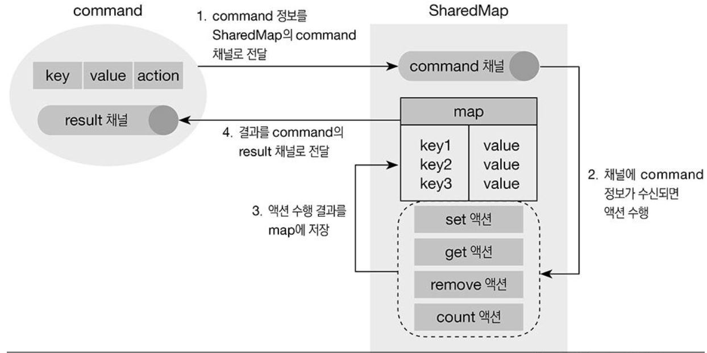

# **공유 메모리**
- **여러 스레드**에서 **공유 메모리**에 접근 할 때에는 **sync.Mutex**로 잠금 기반 코드를 작성해야한다.
- Go는 **메모리 공유**가 아닌 **메세지 전달 방식**으로 여러 고루틴의 간 **동기화**를 권장한다.
- 이번 절에서는 **뮤텍스**를 사용하지 않고 **공유 메모리**를 사용하는 방법을 소개한다.

**Go의 기본 맵은 동시성을 보장하지 않는다.**  
**채널로 map[string]interface{} 형태로 맵을 여러 고루틴에서 공유하여 사용해보다.**

 

---
## **SharedMap 정의**
- 먼저 다음과 같이 **SharedMap**과 **command** 구조체를 정의했다.
    ~~~go
    type SharedMap struct {
        m map[string]interface{} // 실제 값이 저장될 맵
        c chan commmand // SharedMap에 명령을 전달하기 위한 채널
    }

    type command struct {
        key string  // 키
        value interface{} // 값
        action int // 수행할 액션
        resutlt chan<-interface{} // 액션 처리 결과
    }
    ~~~
    
**SharedMap과 command의 역할과 관련성**

 

- **command의 action으로 사용할 값은 다음과 같이 상수로 정의한다.**
    ~~~go
    const (
        set = iota
        get
        remove
        count
    )
    ~~~

 

## **SharedMap 메서드 정의**
- 상수로 정의한 action 값 **set, get, remove, count**에 대한 **메서드**를 다음과 같이 정의한다.
    ~~~go
    func (sm SharedMap) Set(k string, v interface{}) {
        sm.c <- command{action:set, key:k, value:v}
    }

    func (sm SharedMap) Get(k string) (interface{}, bool) {
        callback := make(chan interface{})
        sm.c <- command{action: get, key:k, result:callback}
        result := (<-callback).([2]interface{})
        return result[0], result[1].(bool)
    }

    func (sm SharedMap) Remove(k string) {
        sm.c <- command{action:remove, key:k}
    }

    func (sm SharedMap) Count() int {
        callback := make(chan interface{})
        sm.c <- command{action:count, result:callback}
        return (<-callback).(int)
    }
    ~~~
- 기본 패턴은 **command** 값을 만들어 **SharedMap의 c 채널**로 **전달**하고
- **result** 필드로 지정한 채널을 통해 **결과**를 받아와서 **반환**하는 식이다.

 

## **SharedMap 실행**
- **run() 메서드**로 SharedMap을 실행하면 **c 채널**로 **command**를 전달받아 해당 액션을 **수행**한다.
    ~~~go
    func (sm SharedMap) Run() {
        for cmd := range sm.c {
            switch cmd.action {
            case set:
                sm.m[cmd.key] = cmd.value
            case get:
                v, ok := sm.m[cmd.key]
                cmd.result <- [2]interface{}{v, ok}
            case remove:
                delete(sm.m, cmd.key)
            case count:
                cmd.result <- len(sm.m)
            }
        }
    }
   ~~~
- **SharedMap** 내부에 있는 **맵 m**에 액션을 **수행**하고 **결과**를 **cmd.result** 채널로 **전달**한다.

 

## **SharedMap 생성**
- SharedMap을 생성한 후 **run()** 메서드를 **고루틴**으로 실행하면 **SharedMap**이 **실행**된다.
    ~~~go
    func NewMap() SharedMap {
        sm := SharedMap{
            m: make(map[string]interface{}),
            c: make(chan command),
        }
        go sm.Run()
        return sm
    }
    ~~~

 

---
## **SharedMap 사용**
- **NewMap()** 함수로 **SharedMap**을 생성하면 **Set(), Get(), Remove(), Count() 메서드**를 통해 맵을 사용할 수 있다.
    ~~~go
    func main() {
        m := NewMap()

        for i:=0; i<1000; i++ {
            m.Set("foo"+string(i), "bar")
        }

        for i:=0; i<500; i++ {
            m.Remove("foo"+string(i))
        }

        if _, ok := m.Get("foo"); ok {
            fmt.Println("foo is exists")
        } else {
            fmt.Println("foo is not exists")
        }

        fmt.Println("Count:", m.Count())
    }
    ~~~
    ~~~
    실행 결과

    foo is not exists
    Count: 500
    ~~~